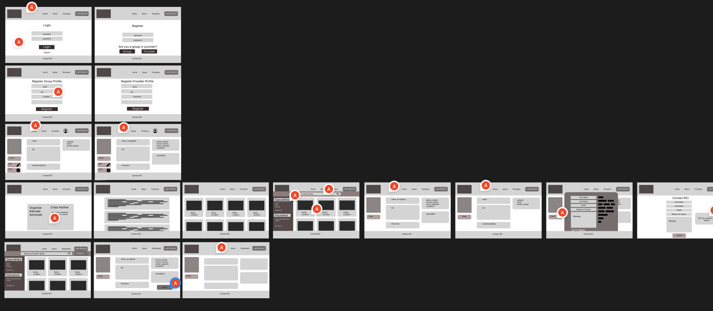
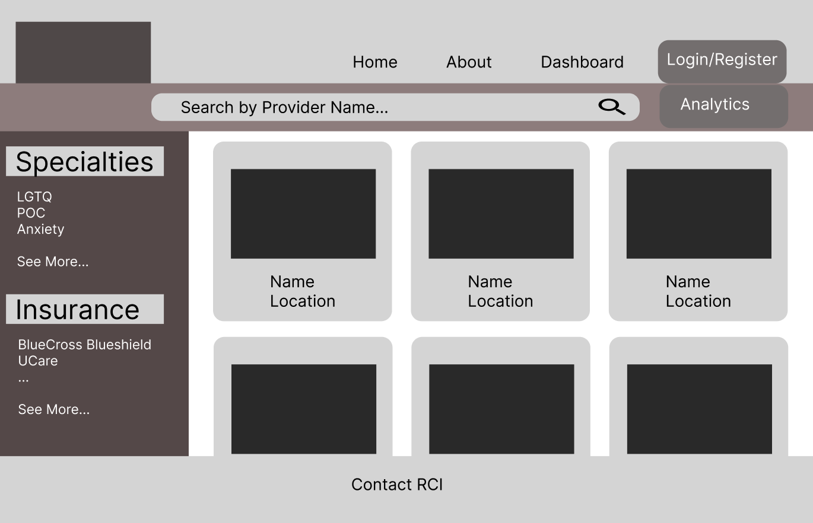
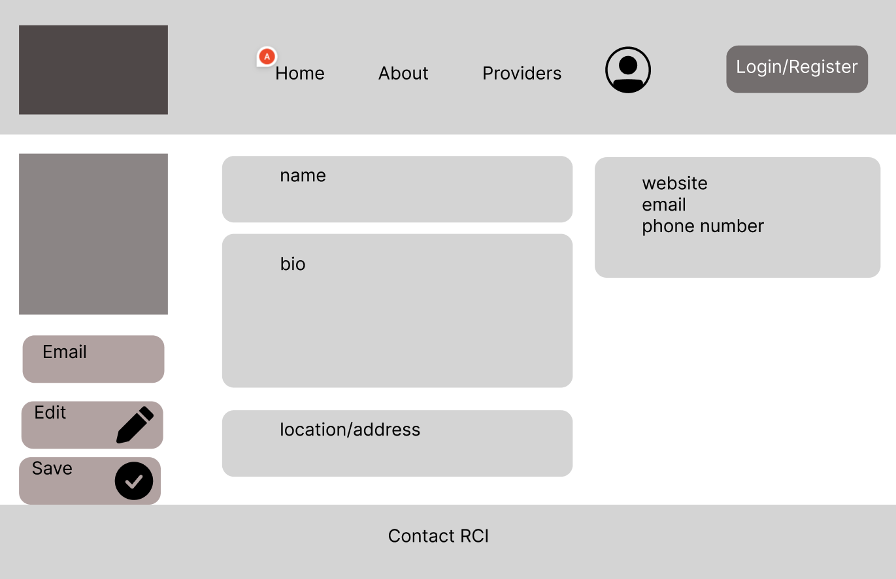
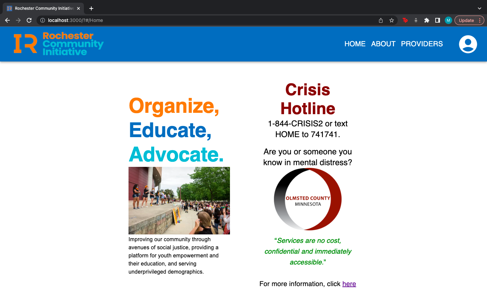
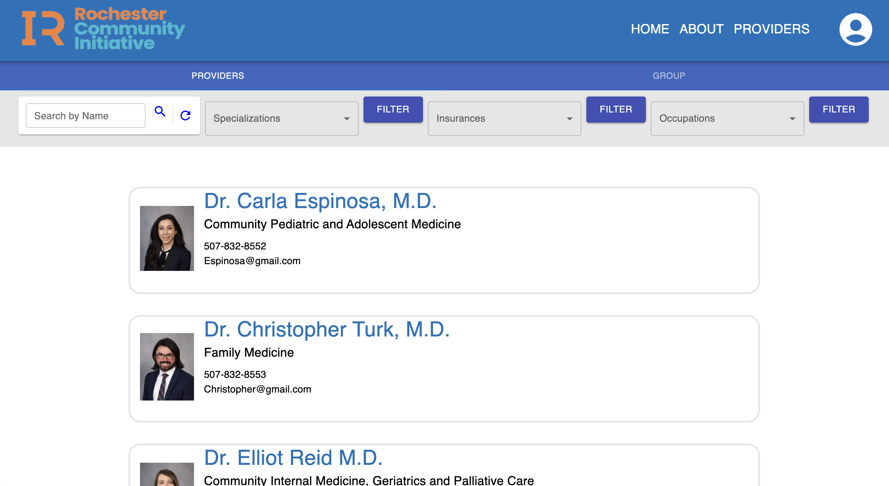
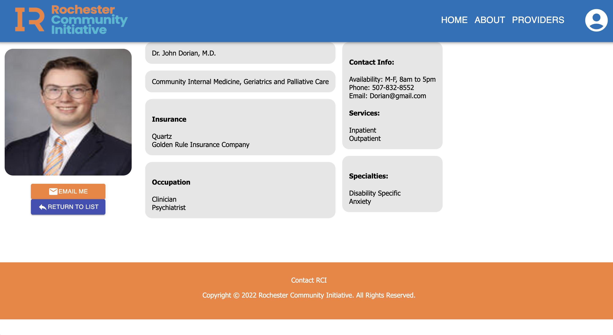
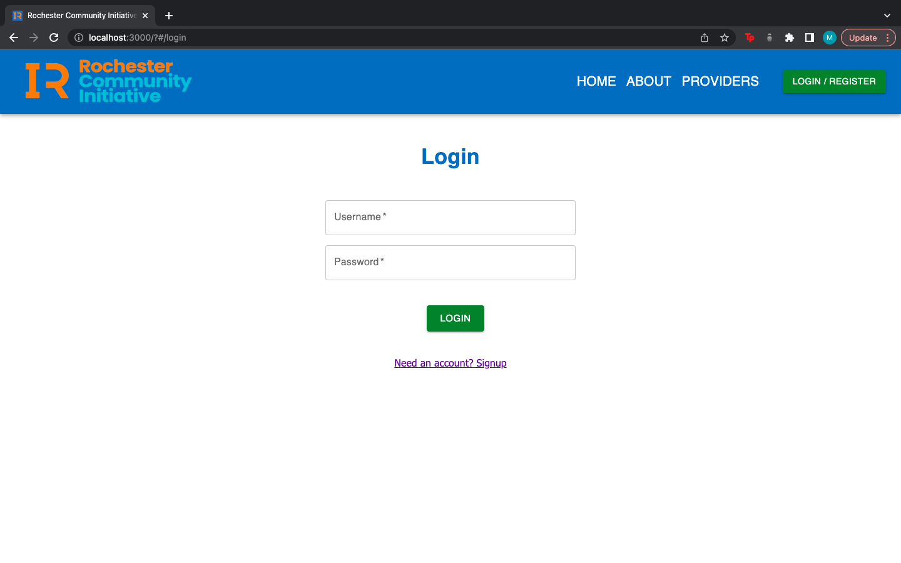
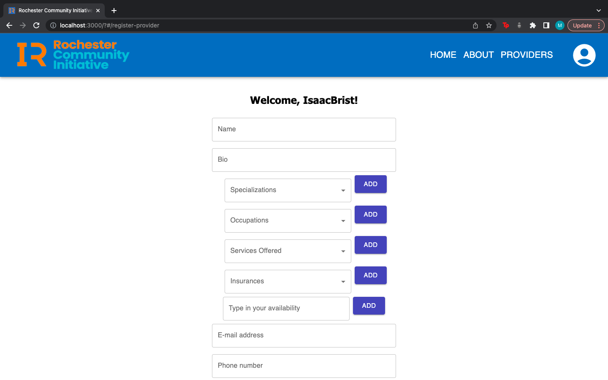
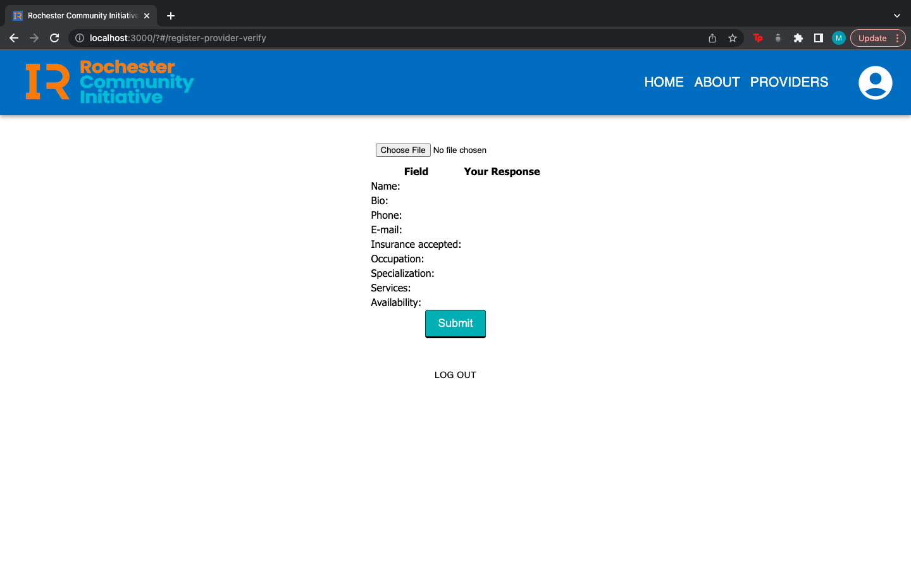

# Rochester Community Inititive

Project Duration: 2 week sprint

Rochester Community Initiative is a database is a resource application that keeps a record of the mental health providers in Rochester. The application allows for mental health providers to make an account and have it be displayed on this platform. Users don't need to log in to be able to use this app. Users can click on the 'providers' button in the navigation bar to see a list of all the providers available on this platform. Users can then search and filter providers by different criterias such as specialty, insurance and occupations. Users are then able to send providers emails by going to each provider's profile, directly connecting each user with a mental health professional.

<!-- Live Version deployed on Heroku at:
https://rcimentalhealth.herokuapp.com/#/home -->

## Planing and Development
### Database ERD - Entity Relationship Diagram

### User Stories - Planned out in Figma

## UI Design - Components & Page Design mockups in Figma
### List of Providers Page

### Provider Details Page

## Final Product
### Home Page

### List of Providers Page

### Provider Details Page

### Login Page

### Registration Page

### Profile Info Verification Page

## Prerequisites
Before starting to launch this application, you need to have the following software installed on your computer:

Node.js
PostgreSQL
Nodemon

## Database Setup

Make a new database called client_project in PostgresSQL and use the database.sql file in the root of this project to set up all of the table that will be used. this file will also include information such as user access levels, provider usernames and contact information.

## Creating the .ENV File

Create a .env file at the root of the project. thi file will require several pieces of information that will each need to be acquired separately. 

## Installation 

1. Run npm install
2. Start PostgreSQL using brew services start postgresql
3. Run npm run server
4. Run npm run client 
5. Naviagate to localhost:3000

## How to Use 

This application will be used by three types of users, regular users searching for mental health professionals, mental health providers and the admin.

- New mental health providers will sign up for an account either as an individual or group/clinic. The registration will require a username and password, providers will then be prompted to fill out information about themselves and their services and add a profile picture. After logging in, providers will be taken to the list view and see their profile and information.
- Users seeking mental health do not need to login or register. Users can go to the providers page by clicking on the button on the navigation bar. The providers page will have a list of all the providers available and when the user clicks a provider they will see all the detailed information about the provider.
- The providers page has a search bar and filter options.
- Admin users will be able to see what all users see on their end and will have a delete button show up on every provider.

## Built With

This application uses the following technologies:

- React
- Redux
- Redux-Sagas
- Express
- Passport
- PostgreSQL
- Material -Ul
- SweetAlert2
- Emailjs
- Multer

(the full list of dependencies can be found in the package.json file)

## Acknowledgements

First and foremost, we would like to thank Amelia Decker and the RCI team for giving us the pleasure of working with them to make their vision a reality. This is a wonderful project and we are glad to have been a part of it. We would like to thank Prime Digital Academy for allowing us the opportunity to put our acquired skills into action by connecting us with a real-world client with an extraordinary vision.
A very special thanks to our instructors, Liz Kerber and Dane Smith, for providing us with the tools and knowledge to build this application. Their instruction has been invaluable in leading us down the road to successful careers as software developers.

## Support
For any Questions, concerns, or suggestions, please feel free to email the developers who worked on this project:

- averyang2674@gmail.com
- isaacbrist@gmail.com
- miskiali222@gmail.com
- nate.notermann@gmail.com
- tcmccoy@gmail.com
